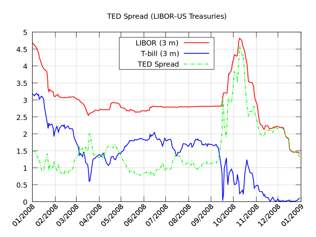
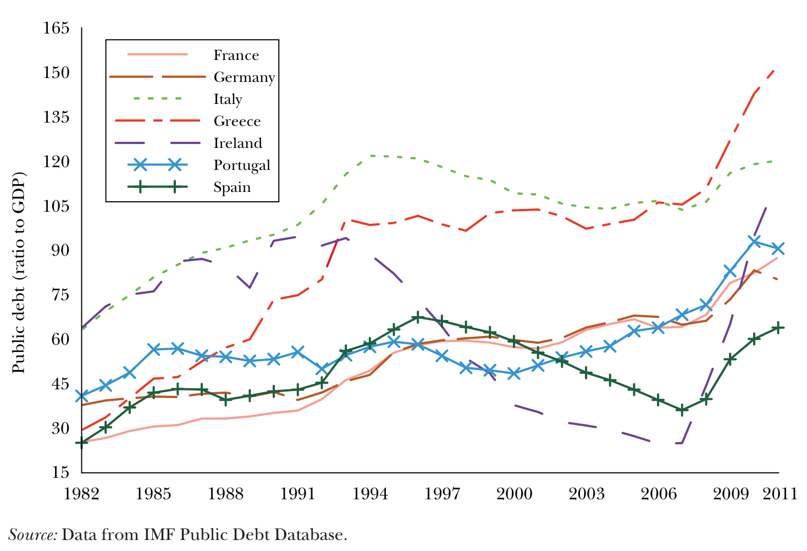
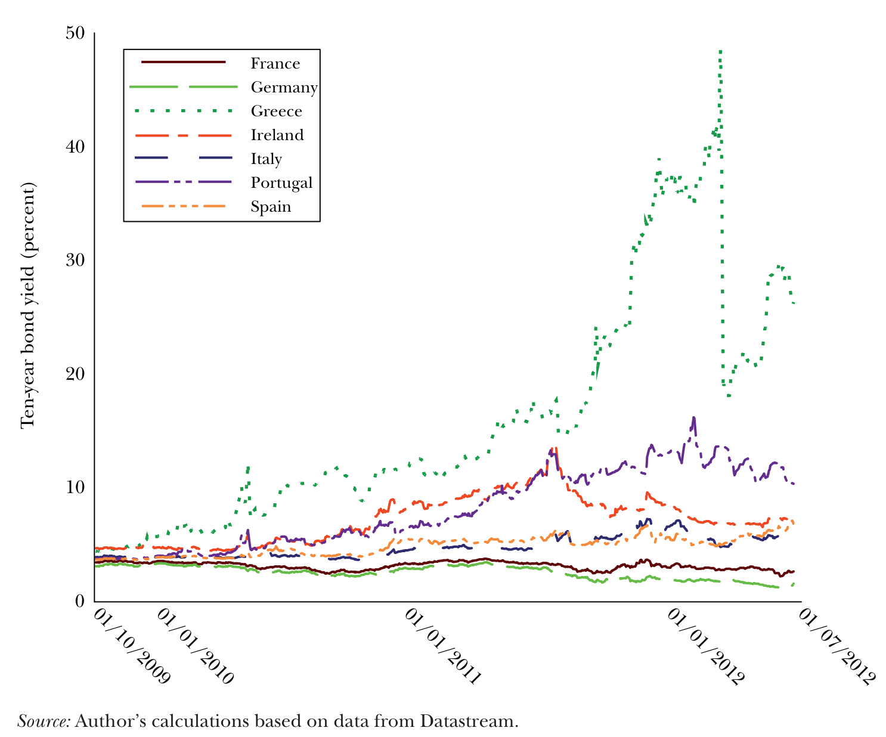

# Introduction
```{=latex}
\chapterauthor{Strahinja Trenkic}
```

## Motivation

A retail bank has a customer call centre as one of its units, through which the bank communicates with potential new clients and offers term deposits. Term deposits are defined as a fixed-term investment that includes the deposit of money into an account at a financial institution.

Such an instrument would generate revenue for the bank, hence the bank records the outcomes of these phone calls along side other data related to the person being called, the economic indicators and certain parameters of the previous contact with the given person. The motivation behind the project is clear, by analysing previous phone calls the bank would like to improve its telemarketing results in two dimensions:

1. The efficiency dimension, or in other words how to reduce the number of phone calls the bank is performing and therefore reduce the costs associated with telemarketing;
2. The effectiveness dimension, or in other words how to potentially improve the result and get more clients or at least the same number to deposit their money with our bank.

We also need to understand the economic and historic context behind the data set. In 2008, the world was plunged in the deepest economic recession since the 1930s. After the bankruptcy of The Lehman Brothers, the financial market was shaken to its core and governments as central banks started unprecedented levels of quantitative easing to save jobs and revitalize the economy. As can be seen on the chart below this caused a huge spike in the famous TED spread, one of the leading indicators for credit risk, since it represents the difference between a riskless investment (T-Bill) and the risk banks transfer when loaning to each other. The wider the spread, the more default risk is priced into the borrowing market. It is trivial to conclude that such an increase in risk will have a major impact not only on the telemarketing campaign but also the representability and timelessness of the data gathered through it.



Given that the data set is based on a Portuguese bank, it is also worth mentioning that Portugal and other European countries were facing a fiscal debt crisis. @lane_european_2012 discussed this issue and showed that Portugal started increasing its debt level after the 2008 financial crisis and had to increase its bond yield in 2010, which implied that its government was facing high debt default risk, as shown by figures 2 and 3.





Can we develop a data-driven approach to help the bank increase its success rate of telemarketing while incorporating the economic context? Several other questions can be raised at this point:

1. How did the economic crisis affect consumer behaviour and how did it manifest itself in the data?
2. How does one's education, marital status, job, etc. affect their economic choices?
3. Do people prefer being called on the mobile phone or landline?
4. Does a predictive model exist that can predict a telemarketing outcome using client and economic data?

## Data Set Description

The bank marketing data set was collected by @moro_data_2014 and ordered by date ranging from May 2008 to November 2010. The data was ordered by date even though its year has to be inferred manually. The 20 input features were categorized and described as follows:

**A. Bank client data:**

`age`: age 

`job`: type of job

`marital`: marital status

`education`: education level

`default`: has credit in default?

`housing`: has housing loan?

`loan`: has personal loan?

**B. Related with the last contact of the current campaign:**

`contact`: contact communication type

`month`: last contact month of year

`day_of_week`: last contact day of the week

`duration`: last contact duration, in seconds 


**C. Other attributes:**


`campaign`: number of contacts performed during this campaign and for this client

`pdays`: number of days that passed by after the client was last contacted from a previous
campaign

`previous`: number of contacts performed before this campaign and for this client

`poutcome`: outcome of the previous marketing campaign

**D. Social and economic context attributes:**

`emp.var.rate`: employment variation rate, quarterly indicator

`cons.price.idx`: consumer price index, monthly indicator

`cons.conf.idx`: consumer confidence index, monthly indicator

`euribor3m`: euribor 3 month rate, daily indicator

`nr.employed`: number of employees, quarterly indicator

**Output variable:**

`y`: has the client subscribed a term deposit?

It is important to note that `duration` attribute highly affects the output target. Yet, the duration is not known before a call is performed. Also, after the end of the call `y` is known. Thus, this input should only be included for benchmark purposes and should be discarded.
