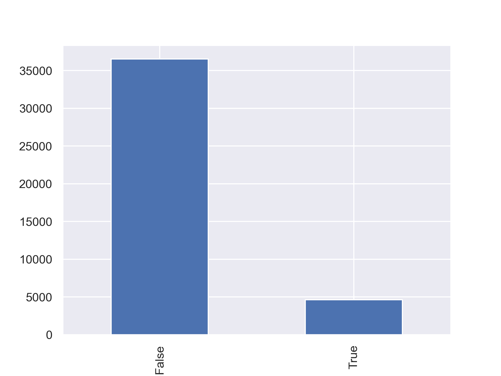
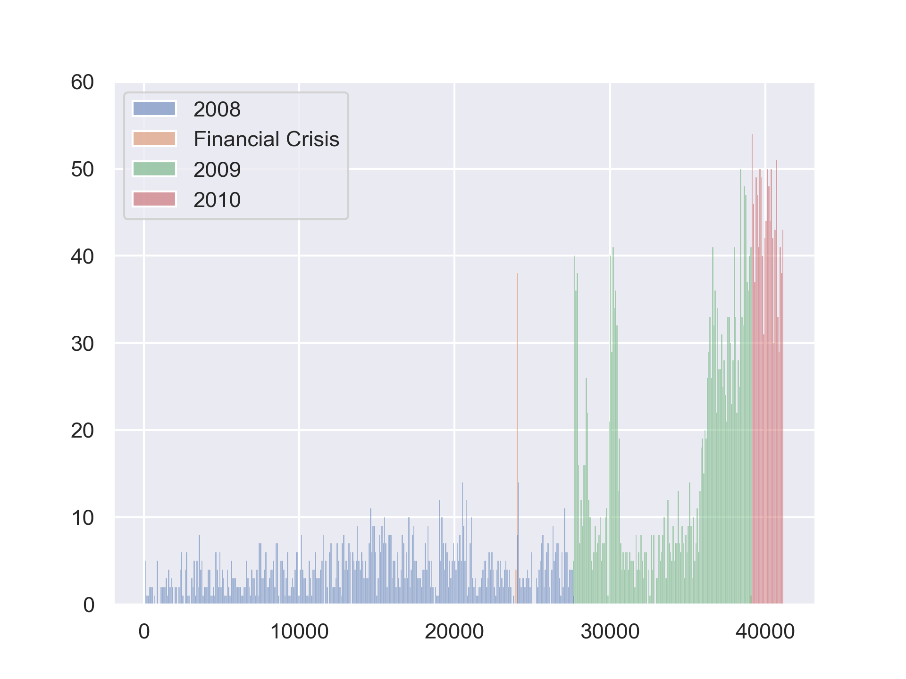
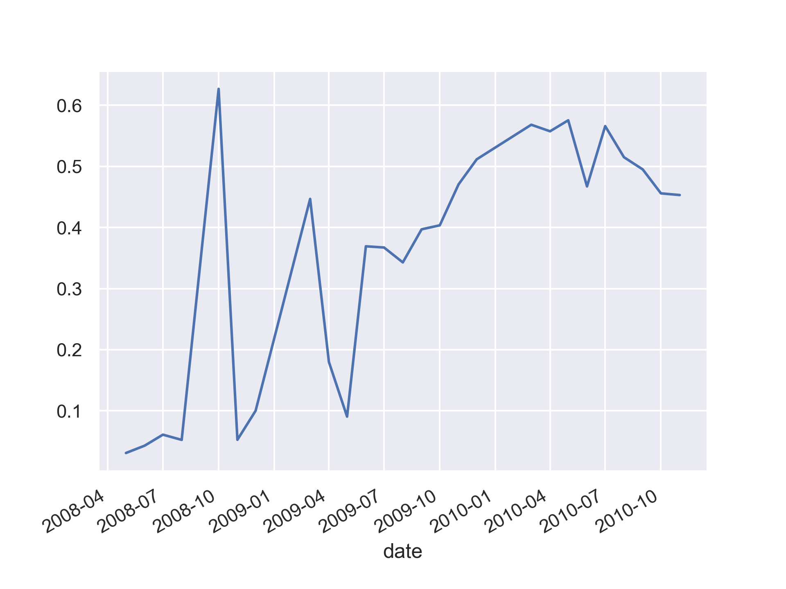
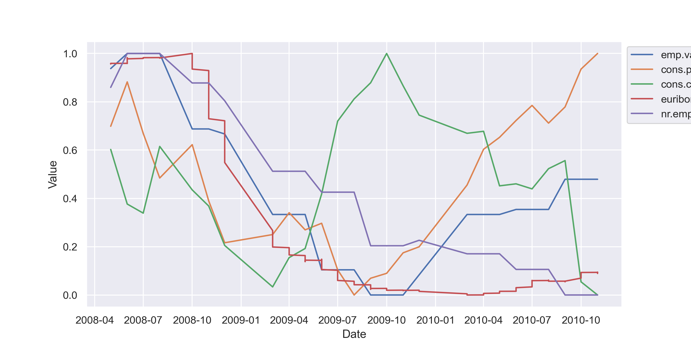
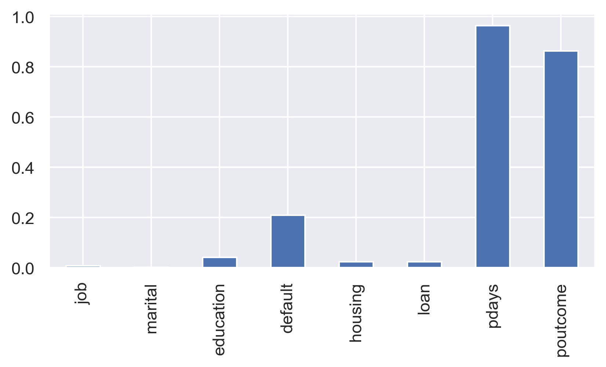
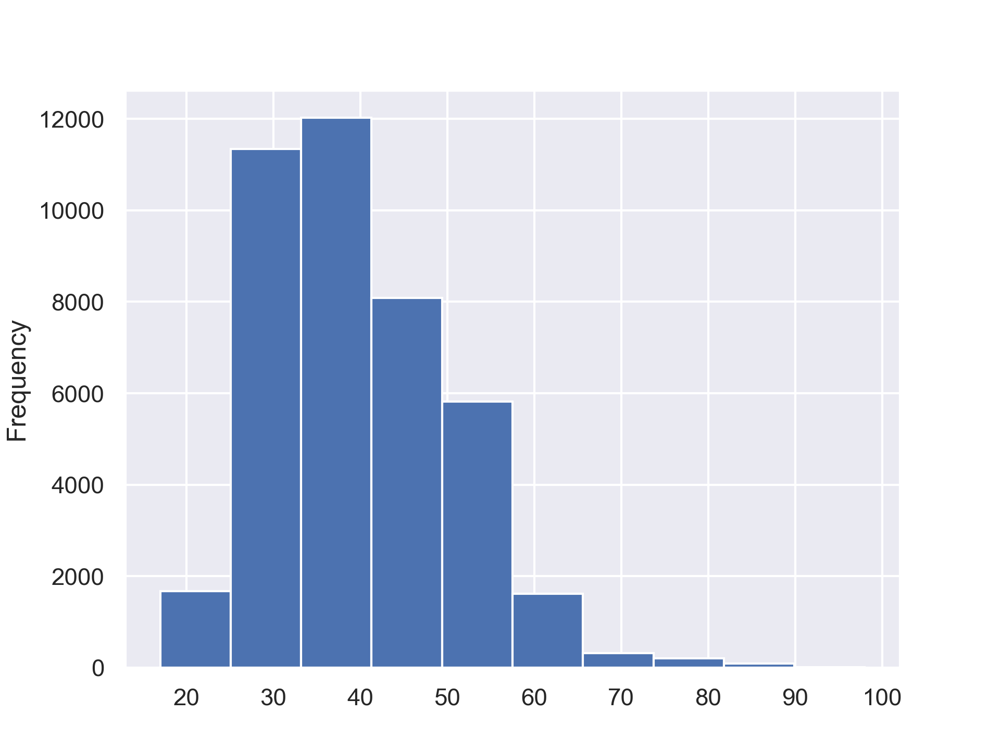
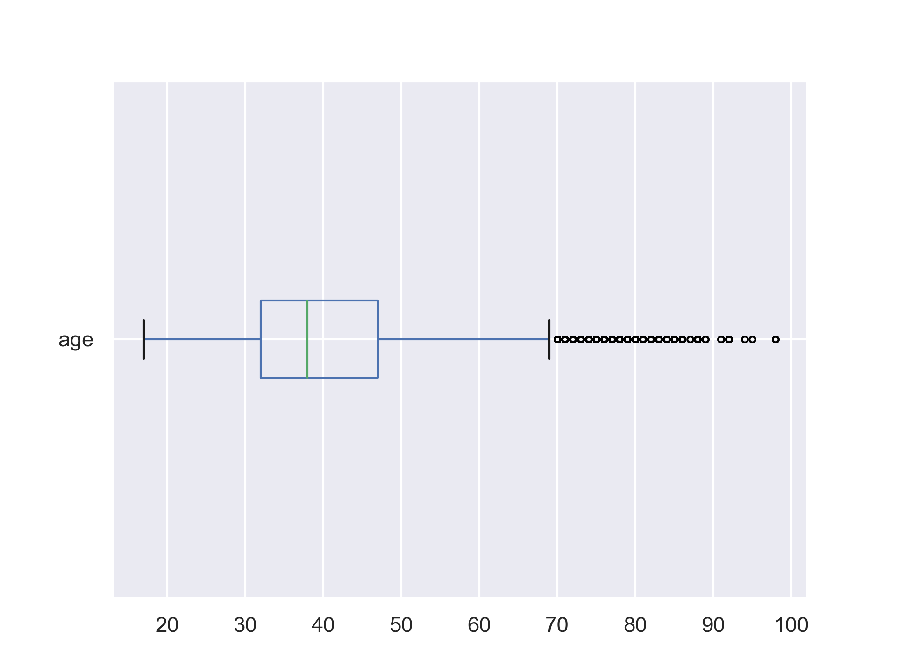
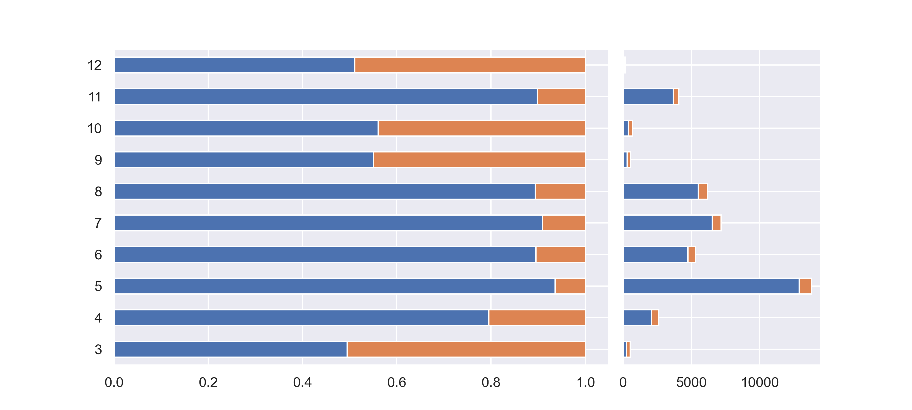
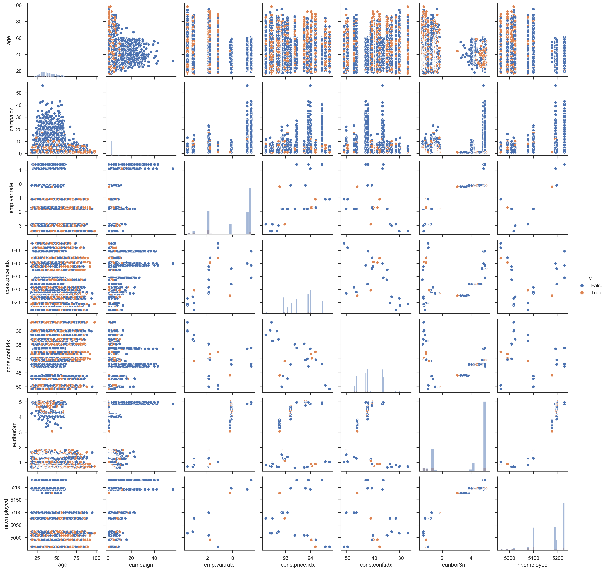

# Exploratory Data Analysis
```{=latex}
\chapterauthor{Fan Jia}
```

Exploratory Data Analysis is a process of exploring the data set with no assumptions or hypotheses made, using non-graphical and graphical, univariate and multivariate methods. The objective is to gain intuitive insights, discover distribution characteristics and find out missing values in the data set.

## Target Variable
The first thing we investigate is the target variable `y`, which is abinary variable measuring the campaign outcome, representing whether a client has subscribed to a long-term deposit or not during our campaign.



There are more than 40,000 observations in our data set, and only 11.3% of them have positive outcomes, which means that we have a significantly unbalanced data set. Since our data was collected during the 2008 financial crisis, we pay particular attention to this time factor and visualize the positive Y values across that specific time frame.



In the graph above, the thin orange line indicates the outbreak of the financial crisis. We can see a massive surge in positive campaign outcomes afterwards, meaning people were actively taking advantage of certain economic factors, such as lower interest rates. We can also see a steady growth of the positive outcome rate since July 2009 from the graph below.



{width=100%}

Highly relevant to the crisis are the five economic indicators in our data set, displayed as above, which show significant predicting power in almost all of our models. In 2008, all of them went down first, but the consumer confidence index (green line) was the leading recovery factor, followed by the consumer price index (orange line). The recovery of the positive outcome rate of our campaign started at the same time. Furthermore, the drop of interest rates captured by the Euribor 3-month rate (red line) significantly correlated with the campaign success.

## Missing Values
We use the `info()` function to get an overview of our data and find out many missing values, especially for features like `pdays` and `poutcome`, in which 90% of the rows have missing values, as shown in the bar chart below. These missing values require a lot of special attention during the feature engineering process.



## Feature Explorations
### `age`
For client profile features, first, we plot the distribution of age relative to Y, as shown below.30-50-year-old people are the majority in our data set. People in their 30s and people older than 60 are more likely to give positive responses to the deposit. There are not many outrageous outliers, therefore we keep all data for age.





### `job`
This next graph shows the outcome percentage in each job group, with the orange color denoting positive outcomes. On the right is the instance count distribution of each group. There is a large percentage of technicians, blue-collar workers and admins. However, it is students and retired people that are most likely to say "yes" to the long-term deposit.


### `education`
In terms of education, although most people in our data set have above-high-school education, the groups that are most likely to respond positively are the least and the most educated. 


### `default`
default is a peculiar feature that captures whether people previously had defaulted on credit, and it is a highly sensitive piece of information. As presented in the figure below, the majority of clients declare no default record, however, 8600 instances are “unknown”. Given the private nature of this feature, we believe there are hidden stories open for interpretations behind the “unknown” values and they might influence people's financial decisions. Therefore, we decide to treat the unknown values as an individual category and let it speak for itself.


### `contact`
For features capturing characteristics of current campaign, contact is an essential binary feature that represents the tool used to contact clients. And we see a robust positive outcome rate for cellular usage.


### `month`
With regard to the months in which the last contact was made, the distribution concentrates in summer, however, these months have the lowest positive outcome rates. In months with fewer contacts, there seem to be higher success rates of securing a long-term deposit with the clients.



### `pdays`
Next is the most challenging feature, pdays, which represents the number of days passed since the last contact with a client. It has almost 40,000 missing values. As demonstrated in the graph below, the "NA" category on the top dominates the entire distribution. Simultaneously, the other 1500 rows that do have values seem to show positive relationships with the outcome. We spent a significant amount of time and effort to deal with this feature, and this process will be discussed in the feature engineering section.


### `previous`
The previous feature is also very challenging, which measures the number of contacts performed to a client before this campaign. It has 36,000 missing values, and for those observations with actual values, their relationships with the outcome are seemingly positive.


### `poutcome`
This is the feature that reports the outcomes of the previous campaign. Over 35,000 observations have missing values, as presented below. However, when combining this featuring with `pdays` and `previous`, there seem to be some contradictions.


 Missing values in `pdays` mean that the clients were not previously contacted and therefore should not have values in `poutcome`. But `poutcome` has fewer missing values than `pdays` does, as seen in the second graph below. We print out the 4110 rows where clients have not been contacted but have `poutcome` values and see how many times they have been contacted before. The results suggest that maybe these clients have been actually contacted, but it was more than 30 days ago, thus the contact date was not recorded.


##  Multivariate Explorations
### Client Data
Furthermore, we explore some multivariate distributions of the positive outcome. First, we found both married and divorced retired people respond positively to our campaign, and single and divorced students are even more enthusiastic. It is also quite interesting that students, retired and illiterate people are more likely to say "yes" to our long-term deposit. Additionally,  divorced illiterate people respond to our campaign extremely well.


### Numerical Features
We also made a scatterplot across important quantitative features with the outcome variable denoted by two colors.

{width=60%}

### Correlation Heatmap
With correlation heatmap, we get a better look at the correlations among features. Four out of five economic indicators have strong correlations with each other. We were worried about collinearity and tried many ways to deal with these features, such as deletion or transformation, but all efforts led to relatively poor model results. Then we realized that they are probably very important features in our data set, so we kept them for the moment. In addition, some features show great correlations with the outcome, such as `previous` and `poutcome`. We tried to use PCA on the entire data set to avoid collinearity, but again, all efforts led to poor model results. Therefore, we decided to keep all features and make changes if needed for specific models.

{width=60%}
