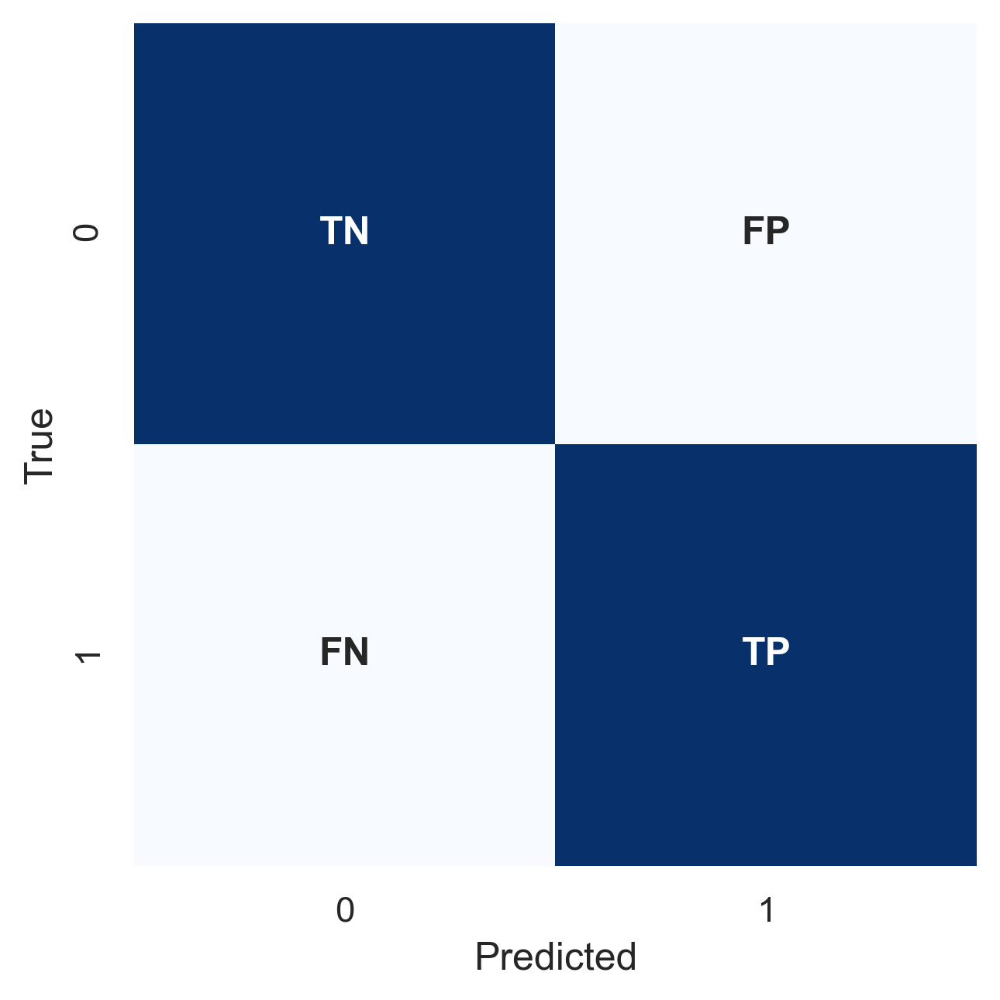
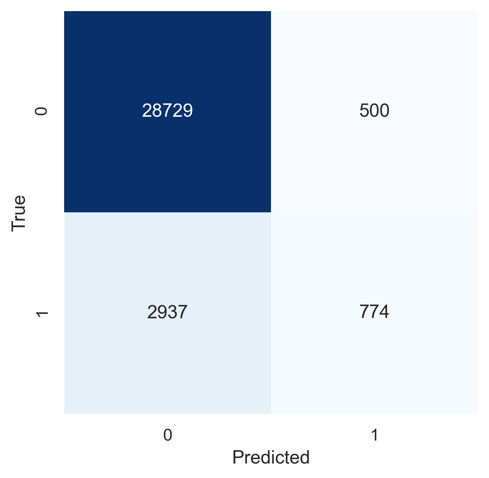
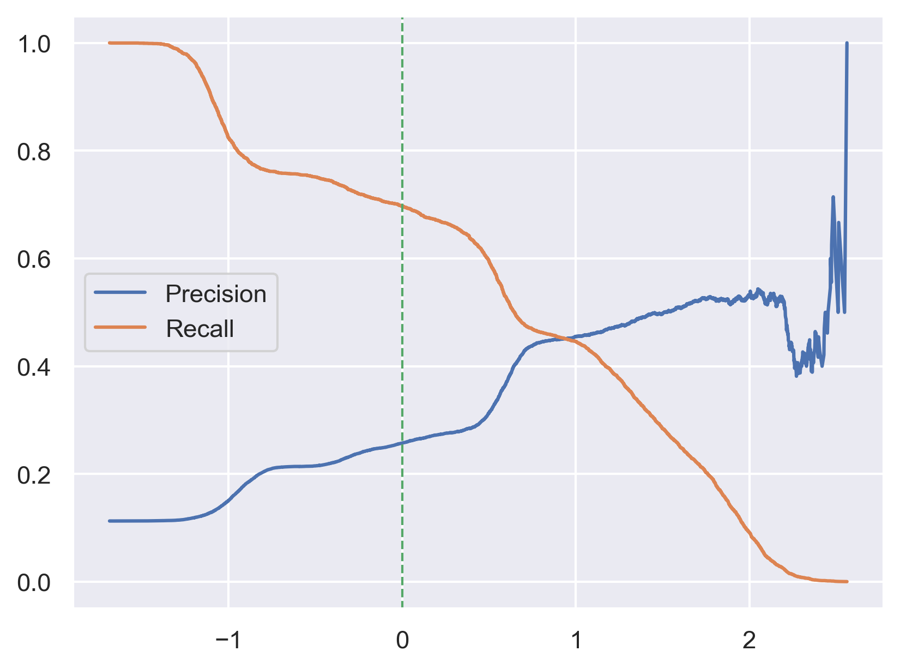
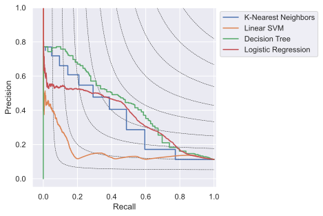
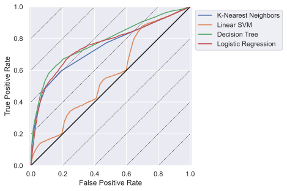

# Performance Evaluation
```{=latex}
\chapterauthor{Jiawei Li}
```

As discussed in chapter 3, we split data into different sets and tune hyperparameters by comparing model performance on these sets. How do we define the performance of machine learning models? A plain and simple approach is using accuracy scores:

$$
\text{Accuracy} = \frac{\text{Number of Correct Predictions}}{\text{Number of Total Predictions}}
$$

However, the accuracy score may be too simplistic. First, it does not reflect the unbalanced outcome of our data set. If the model predicts every outcome as negative while the majority of the outcomes is negative, the model can still achieve a very high accuracy score. Second, the accuracy score does not distinct false positive and false negative errors which may cost the business differently. In the bank marketing context, missing a potential customer (false negative) costs more than phoning an uninterested buyer (false positive). These problems can be solved by using a Confusion Matrix and utilising more metrics for model evaluation. 

## Confusion Matrix
The Confusion Matrix is a contingency table that outputs the counts of the true positive (TP), true negative (TN), false positive (FP), and false negative (FN) predictions. We can use an analogy of fishing to gain more intuitions: The sea consists of fish and rubbish. A fisherman throws the net into the sea and hopes to capture as many fish and as little rubbish as possible. After the fisherman retrieves the net, the fish in the net (the wanted capture) is a true positive outcome, the rubbish in the net (the unwanted capture) is a false positive outcome, the fish in the sea (the wanted leftover) is a false negative outcome, and the rubbish in the sea (the unwanted leftover) is the true negative outcome.

{width=45%}

The Confusion Matrix can be computed by calling `confusion_matrix()` in `scikit-learn` as follows:

```python
from sklearn.model_selection import cross_val_predict
from sklearn.neighbors import KNeighborsClassifier
from sklearn.metrics import confusion_matrix

bank_mkt = import_data set("../data/BankMarketing.csv")
preprocessor = FunctionTransformer(dftransform)
X_train, y_train, *other_sets = split_data set(bank_mkt, preprocessor)
clf = KNeighborsClassifier(n_neighbors=10)
y_pred = cross_val_predict(clf, X_train, y_train, cv=5, n_jobs=-1)
conf_mat = confusion_matrix(y_train, y_pred)
f, ax = plt.subplots()
conf_ax = sns.heatmap(
    conf_mat, ax=ax, annot=True, fmt="", cmap=plt.cm.Blues, cbar=False
)
conf_ax.set_xlabel("Predicted")
conf_ax.set_ylabel("True")
```

{width=45%}

## Metrics From Confusion Matrix

From the Confusion Matrix, we can derive some key performance metrics such as precision and recall. Accuracy, for example, can be written as follows:

$$
ACC = \frac{TP+TN}{TP+FP+TN+FN} 
$$

Precision (PRE) measures the accuracy of the predicted positive outcomes. As in the fisherman analogy, precision is the fish in the net divided by the total number of objects (fish and rubbish) in the net.

$$
PRE = \frac{TP}{TP+FP}
$$

Recall (REC) measures the accuracy of the positive samples, also known as sensitivity or the true positive rate (TPR). Using the fishing analogy, recall is the fish in the net divided by the fish population in total.

$$
REC = TPR = \frac{TP}{P} = \frac{TP}{TP+FN}
$$

Precision and recall are usually trade-offs. A fisherman can narrow his net to capture more fish and therefore increase recall. However, it comes at the cost of capturing more rubbish at the same time and decrease precision. To balance these two metrics, the harmonic mean of precision and recall (F1) is used.

$$
F_1 = 2 \cdot \frac{PRE \times REC}{PRE + REC}
$$

The trade-off logic also applies to the true negative rate (TNR) and the true positive rate (TPR). The true negative rate measures the accuracy of the negative samples and the true positive rate measures the accuracy of the negative samples. The false positive rate is simply one minus the true positive rate.

$$
\begin{aligned}
FPR &= \frac{FP}{N} = \frac{FP}{FP+TN} \\
TNR &= \frac{TN}{N} = \frac{TN}{TN+FP} = 1 - FPR \\
TPR &= \frac{TP}{P} = \frac{TP}{TP+FN} 
\end{aligned}
$$

Balanced accuracy (bACC) is the average of true positive rate and true negative rate.

$$
bACC = \frac{TPR+TNR}{2}
$$

A performance metrics table of classifiers on bank marketing data set is shown below.

|      | Constant Prediction | Random Prediction | K-Nearest Neighbors | Linear SVM | Decision Tree | Logistic Regression |
| :--- | ------------------: | ----------------: | ------------------: | ---------: | ------------: | ------------------: |
| FPR  |                   1 |             0.498 |              0.0171 |      0.005 |         0.143 |               0.258 |
| TNR  |                   0 |             0.501 |               0.982 |      0.994 |         0.856 |               0.741 |
| TPR  |                   1 |             0.495 |               0.208 |      0.038 |         0.613 |               0.698 |
| bACC |                 0.5 |             0.498 |               0.595 |      0.516 |         0.735 |               0.719 |
| REC  |                   1 |             0.495 |               0.208 |      0.038 |         0.613 |               0.698 |
| PRE  |               0.112 |             0.111 |               0.607 |       0.47 |         0.352 |               0.255 |
| F1   |               0.202 |             0.182 |               0.310 |      0.070 |         0.447 |               0.373 |
: Performance metrics of various classifiers

## Metrics From Decision Function

As hinted in the precision-recall trade-off, fisherman can narrow or loss his net. Bank may be happy to capture more potential customers by phoning more clients. A classifier can also adjust its threshold and therefore achieves different precision and recall results. For example, a logistic regression classifier uses the following decision function to distinct the label 0 and 1. When the result of the decision function is 0, the probability for each label is 0.5. It should be noted that not all classifiers have decision functions, predicted probabilies should be used in these cases. 

$$
\text{Decision Function} = b_0 + b_1 x_1 + ... +b_k x_k
$$

The following code plots the logistic regression's precision and recall against the threshold.

```python
from sklearn.linear_model import LogisticRegression
from sklearn.metrics import precision_recall_curve

bank_mkt = import_data set("../data/BankMarketing.csv")
preprocessor = FunctionTransformer(dftransform)
X_train, y_train, *other_sets = split_data set(bank_mkt, preprocessor)
clf = LogisticRegression(class_weight="balanced")
y_score = cross_val_predict(clf, X_train, y_train, cv=5, method="decision_function")
f, ax = plt.subplots()
precisions, recalls, thresholds = precision_recall_curve(y_train, y_score)
pre_rec_df = pd.DataFrame(
    {"Precision": precisions[:-1], "Recall": recalls[:-1]}, index=thresholds
)
pre_rec_ax = pre_rec_df.plot.line(ax=ax, ylim=(-0.05, 1.05))
threshold = 0
pre_rec_ax.plot((threshold, threshold), (-2, 2), linestyle="--", linewidth=1)
```

{width=55%}

We can also plot precision and recall against each other as shown in the following graph. For a marketing campaign, the bank wants to capture as many potential clients as possible given certain budget constraints. Therefore the precision-recall curve should be pushed as far as possible. However, such a mechanism is not reflected by the metrics derived from Confusion Matrix and F1 can be biased towards models with equal precision and recall.



To solve this problem, we introduce receiver operating characteristic (ROC) and average precision (AP) as alternative metrics that incorporate model thresholds. Average precision (AP) summarises the area under the precision-recall curve as the weighted mean of precisions achieved at each threshold, with the increase in recall from the previous threshold used as the weight.

$$
AP = \sum_{n} (REC_n - REC_{n-1})PRE_n
$$

A receiver operating characteristic (ROC) adopts the same logic by plotting TPR against FPR at various threshold settings and calculating the area under the curve, plotted as follows. 



## Performance Evaluation in Practice

In practice, we utilise Confusion Matrix and multiple metrics to evaluate and optimise our models. When dealing with imbalanced data set and metrics show conflicting results, AP is prefered for two reasons[@saito_precision-recall_2015]. First, AP has a range between the minority class percentage and 1. It gives a more straightforward picture of prediction improvements on an imbalanced data set. Second, AP puts more weight on positive outcomes. In our case, losing a potential subscriber costs the bank more than phoning an uninterested buyer. AP matches this reality more when we evaluate model performance.
