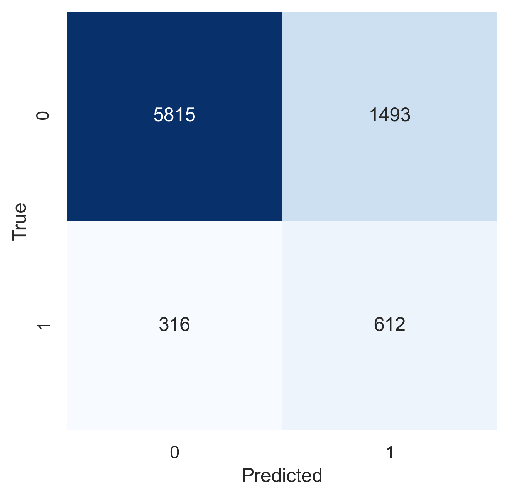

# Support Vector Machine
```{=latex}
\chapterauthor{Qiqi Zhou}
```

The purpose of the Support Vector Machine is to find a hyperplane that distinctly classifies the data points in an N-dimensional space. The hyperplane is the decision boundary that classifies the data points and support vectors are the data points that are closer to the hyperplane which influences the position and orientation of the hyperplane.

The worth of the classifier is how well it classifies the unseen data points and therefore our objective is to find a plane with the maximum margin i.e the distance of an observation from the hyperplane. The margin brings in extra confidence that the further data points will be classified correctly.

## Hyperparameters

### Maximum Margin

The understanding of SVM is derived from the loss function of Logistic Regression with l2 regularization:

$$ 
J(\theta)=\frac 1m \sum_{i=1}^m [y^{i}(−log(\hat{p}^{i}))+(1−y^{i})(−log(1−\hat{p}^{i}))]+ \frac λ {2m} \sum_{j=1}^n\theta_2^{j} 
$$

where

$$
\hat{p}^{i}=σ(\theta^{ T}⋅ x^{i})=1/(1+e^ {−  \theta ^T}⋅  x^{i})
$$

In the realm of loss function of Logistic Regression, the individual loss contribution to the overall function is $−log(\hat{p}^{i})$ if $y^{i}= 1$ and $−log(1−\hat{p}^{i})$ if $y^{i}= 0$. By replacing the individual loss contribution to $max(0,1−\theta^{ T}⋅ x^{i})$ and $max(0,1+\theta^{T}⋅ x^{i})$ for $y^{i}= 1$ and $y^{i}= 0$ respectively, SVM penalizes the margin violation more than logistic regression by requiring a prediction bigger than 1 for y =1 and a prediction smaller than -1 if y = 0.

### Regularizaiton

The regularization term plays the role of widening the distance between the two margins and tells SVM how much we want to avoid the wrong misclassification. A hyperplane with maximal margin might be extremely sensitive to a change in the data points and may lead to overfitting problems.

To achieve the balance of greater robustness and better classification of the model, we may consider it worthwhile to misclassify a few training data points to do a better job in separating the future data points.

Hyperparameter C in SVM allows us to dictate the tradeoff between having a wide margin and correctly classifying the training data points. In other words, a large value for C will shrink the margin distance of hyperplane while a small value for C will aim for a larger-margin separator even if it misclassifies some data points.

### Gamma 

Gamma controls how far the influence of a single observation on the decision boundary. The high Gamma indicates only the points closer to the plausible hyperplane are considered and vice versa.

### Kernel

For linearly separable and almost linearly separable data, SVM works well. For data that is not linearly separable, we can project the data to a space where it is linearly separable. What Kernel Trick does it utilizes the existing features and applies some transformations to create new features and calculates the nonlinear decision boundary in higher dimension by using these features.

## Linear SVM

``` python
linear_svm = LinearSVC(dual=False, class_weight="balanced", random_state=42)

param_distributions = {"loss": ["squared_hinge", "hinge"],
                       "C": loguniform(1e0, 1e3)}

random_search = RandomizedSearchCV(linear_svm,
                                   param_distributions,
                                   scoring="average_precision",
                                   cv=5,
                                   n_jobs=-1,
                                   n_iter=100)

grid_fit = random_search.fit(X_train, y_train)
grid_results = random_search.cv_results_
grid_best_params = random_search.best_params_
grid_best_score = random_search.best_score_

print(f"best parameters: {grid_best_params}, mean test score: {grid_best_score}")

param_grid = [{"C": [5,2,1]}]
grid_search = GridSearchCV(linear_svm,
                           param_grid,
                           scoring="average_precision",
                           return_train_score=True,
                           cv=5,
                           n_jobs=-1)
grid_fit = grid_search.fit(X_train, y_train)
grid_results = grid_search.cv_results_
grid_best_params = grid_search.best_params_
grid_best_score = grid_search.best_score_
print(f"best parameters: {grid_best_params}, mean test score: {grid_best_score}")

linear_svm = LinearSVC(loss="squared_hinge",
                       C=1,
                       dual=False,
                       class_weight="balanced",
                       random_state=42)
```

|      | Train    | Validate | Test     |
| ---: | :------- | :------- | :------- |
|  TNR | 0.795108 | 0.791310 | 0.795703 |
|  TPR | 0.664534 | 0.691375 | 0.659483 |
| bACC | 0.729821 | 0.741342 | 0.727593 |
|  ROC | 0.785562 | 0.786010 | 0.781580 |
|  REC | 0.664534 | 0.691375 | 0.659483 |
|  PRE | 0.291691 | 0.296018 | 0.290736 |
|   AP | 0.435728 | 0.432823 | 0.437258 |
: Performance metrics of Linear SVM

{width=45%}

## Non-Linear SVM

We use the pipeline to ensure that in the cross validation set, the kernel function is only applied to training fold which is exactly the same fold used for fitting the model. We also do a comparison between SGDClassifier and Linear SVC and the latter one gave us slightly better AP.

```python
rbf_sgd_clf = Pipeline([
    ("rbf", RBFSampler(random_state=42)),
    ("svm", SGDClassifier(class_weight="balanced"))
])
param_distributions = {
    "rbf__gamma": loguniform(1e-6, 1e-3),
    "svm__alpha": loguniform(1e-10, 1e-6)}
random_search = RandomizedSearchCV(rbf_sgd_clf,
                                   param_distributions,
                                   scoring="average_precision",
                                   cv=5,
                                   n_jobs=-1,
                                   n_iter=10)
grid_fit = random_search.fit(X_train, y_train)
grid_results = random_search.cv_results_
grid_best_params = random_search.best_params_
grid_best_score = random_search.best_score_
print(f"best parameters: {grid_best_params}, mean test score: {grid_best_score}")

param_grid = {
    "rbf__gamma": [0.0008, 0.0001, 0.001],
    "svm__alpha": [1e-7, 1e-6, 1e-5]}
grid_search = GridSearchCV(rbf_sgd_clf,
                           param_grid,
                           scoring="average_precision",
                           cv=5,
                           n_jobs=-1)

grid_fit = grid_search.fit(X_train, y_train)
grid_results = grid_search.cv_results_
grid_best_params = grid_search.best_params_
grid_best_score = grid_search.best_score_
print(f"best parameters: {grid_best_params}, mean test score: {grid_best_score}")

rbf_sgd_tuned = rbf_sgd_clf.set_params(rbf__gamma=0.0009, svm__alpha=1e-6)
benchmark(bank_mkt, hot_transformer, rbf_sgd_tuned)
```

|      | Train    | Validate | Test     |
| ---: | :------- | :------- | :------- |
|  TNR | 0.792798 | 0.797639 | 0.644499 |
|  TPR | 0.678680 | 0.681941 | 0.752155 |
| bACC | 0.735739 | 0.739790 | 0.698327 |
|  ROC | 0.791381 | 0.789337 | 0.786777 |
|  REC | 0.678680 | 0.681941 | 0.752155 |
|  PRE | 0.293732 | 0.299586 | 0.211772 |
|   AP | 0.436139 | 0.444426 | 0.437136 |
: Performance metrics of SVM using `SGDClassifier`

{width=45%}

```python
rbf_clf = Pipeline([
    ("rbf", RBFSampler(random_state=42)),
    ("svm", LinearSVC(loss="squared_hinge", dual=False, class_weight="balanced", max_iter=1000))
])

param_distributions = {
    "rbf__gamma": loguniform(1e-6, 1e-3),
    "svm__C": loguniform(1e-1, 1e1)}

random_search = RandomizedSearchCV(rbf_clf,
                                   param_distributions,
                                   scoring="average_precision",
                                   cv=5,
                                   n_jobs=-1,
                                   n_iter=10)

grid_fit = random_search.fit(X_train, y_train)
grid_results = random_search.cv_results_
grid_best_params = random_search.best_params_
grid_best_score = random_search.best_score_

print(f"best parameters: {grid_best_params}, mean test score: {grid_best_score}")

param_grid = {
    "rbf__gamma": [0.0001, 0.001, 0.01],
    "svm__C": [1, 10, 20]}

grid_search = GridSearchCV(rbf_clf,
                           param_grid,
                           scoring="average_precision",
                           cv=5,
                           n_jobs=-1)

grid_fit = grid_search.fit(X_train, y_train)
grid_results = grid_search.cv_results_
grid_best_params = grid_search.best_params_
grid_best_score = grid_search.best_score_

print(f"best parameters: {grid_best_params}, mean test score: {grid_best_score}")
rbf_tuned = rbf_clf.set_params(rbf__gamma=0.0009, svm__C=1)
```

|      | Train    | Validate | Test     |
| ---: | :------- | :------- | :------- |
|  TNR | 0.788906 | 0.787889 | 0.794745 |
|  TPR | 0.677669 | 0.676550 | 0.668103 |
| bACC | 0.733288 | 0.732220 | 0.731424 |
|  ROC | 0.787619 | 0.782527 | 0.784626 |
|  REC | 0.677669 | 0.676550 | 0.688103 |
|  PRE | 0.289580 | 0.288175 | 0.292453 |
|   AP | 0.437404 | 0.453640 | 0.440392 |
: Performance metrics of SVM using `LinearSVC`

{width=45%}
