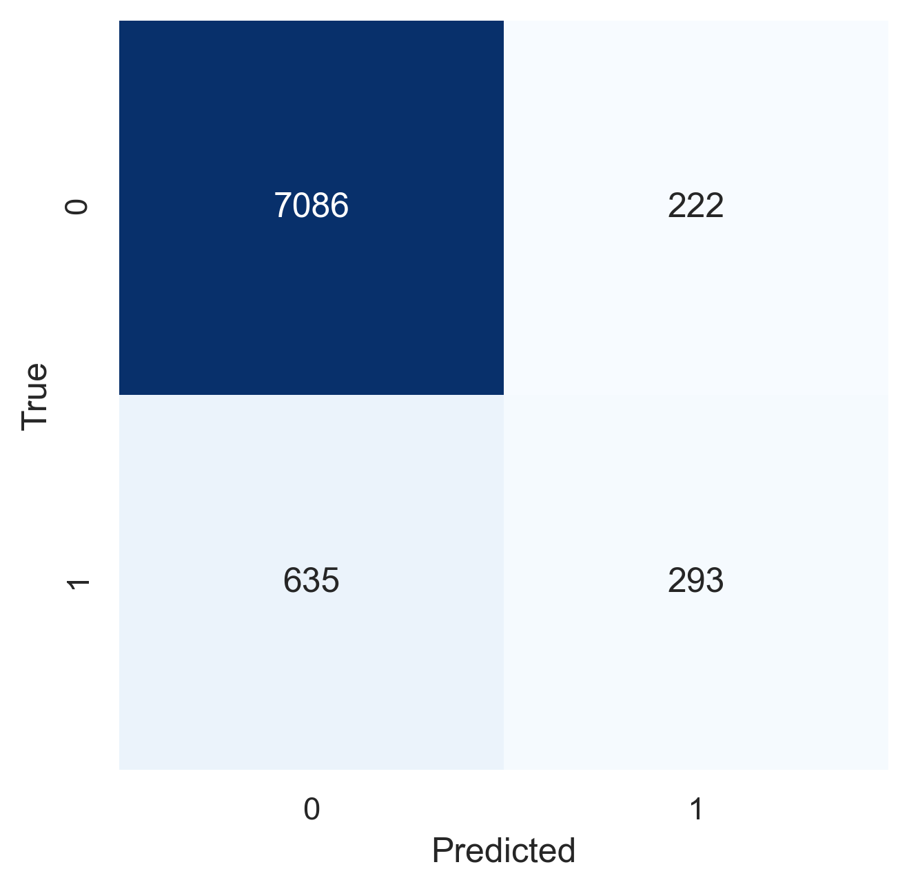

# Neural Network
```{=latex}
\chapterauthor{Qiqi Zhou}
```

Neural Network is a "brain structure" with the following components:

1. an input layer;
2. an arbitrary amount of hidden layers;
3. an output layer;
4. a set of weights and biases between each layer;
5. an activation function for each hidden layer.

Training the neural network model is to find the right values for the weights and biases and it involves multiple iterations of exposing the training dataset to the network. Each iteration of the training process consists of Forward Propagation and Backpropagation. The Forward Propagation is a process where the input data is fed in the forward direction. Each hidden layer accepts the input data and processes it as per the activation function and passes the results to the successive layer. The Backpropagation is to fine tune the weights of a neural net based on error rate obtained in the previous iteration. Error is calculated between the expected outputs and the outputs forward propagated from the network. These errors are then propagated backwards from the output layer to the hidden layer, finding contributions to the errors and updating the weights.

## Hyperparameters

### Learning rate

Learning rate controls how much we are adjusting the weights of our network with respect to the loss gradient.

A small learning rate will only make a slight change to the weights each update and therefore requires more training epochs and travels along the downward slope slowly, whereas a large learning rate leads to rapid changes to the weight. However, a too large learning rate may cause the model to converge too quickly to a local minimum or overshoot the optimal solution.

### Hidden layer sizes

This hyperparameter defines how many hidden layers and how many neurons on each layer we want to have when we are building the architecture of the neural network. 

We want to keep the neural network architecture as simple as possible so that it can be trained fast and well generalized and meanwhile, we also need it to classify the input data well, which may require a relatively complex architecture.

### L2 Regularization

The regularization term will drive down the weights of the matrix and decorrelate the neural network, which in turn decreases the effects of the activation function and prevent overfitting by fitting a less complex model to the data.

### Activation Function

Activation functions are mathematical equations attached to each neuron in the network and they determine the output of the learning model, the accuracy and the computational efficiency of training the model.

With the use of Non-linear activation function, we can create a complex mapping between the network's inputs and outputs which are essential for learning and modelling complex data.

## Grid Search

```python
mlp=MLPClassifier(random_state=42,max_iter=1000)

param_grid ={
    'solver':['lbfgs', 'sgd', 'adam'],
    'learning_rate':["constant","invscaling","adaptive"],
    'hidden_layer_sizes':[(100,),(200,),(20,5,),(10,5,),(100,50,25,)],
    'alpha':[0.0,0.001,0.01],
    'activation' :["logistic","relu","tanh"] }

grid_search = GridSearchCV(estimator=mlp,
                          param_grid=param_grid,
                          scoring = "average_precision",
                          return_train_score=True,
                          cv = 5,
                          n_jobs=-1) 
grid_fit = grid_search.fit(X_train, y_train)
grid_results = grid_search.cv_results_
grid_best_params = grid_search.best_params_
grid_best_score = grid_search.best_score_

mlp_trained=MLPClassifier(solver ="lbfgs",
                          random_state=42,
                          max_iter=1000,
                          activation = 'relu',
                          alpha = 0.01,
                          hidden_layer_sizes = (100,),
                          learning_rate = 'constant')

nn_best = benchmark(bank_mkt, hot_transformer, mlp_trained)
```

|      | Train    | Validate | Test     |
| ---: | :------- | :------- | :------- |
|  TNR | 0.984219 | 0.959117 | 0.969896 |
|  TPR | 0.470192 | 0.295148 | 0.310145 |
| bACC | 0.727206 | 0.627133 | 0.640120 |
|  ROC | 0.900857 | 0.730865 | 0.746097 |
|  REC | 0.470192 | 0.295148 | 0.310345 |
|  PRE | 0.790935 | 0.478166 | 0.566929 |
|   AP | 0.688217 | 0.354089 | 0.396211 |
: Performance metrics of Neural Network

{width=45%}

## Reflections

In machine learning, data can be roughly divided into four categories: Image, Sequence, Graph and Tabular data. The first three types of data have obvious patterns, such as the spatial locality of images and graphs, the contextual relationship and timing dependence of sequences, and so on. However, in tabular data, each feature represents an attribute, such as gender, price, etc. There is generally no obvious and common pattern between features.

Neural networks are more suitable for the first three types of data, that is, data with obvious patterns. Because we can design the corresponding network structure according to the data pattern, so as to select features more efficiently. For example, the  CNN (Convolutional Neural Network) is designed for images, and the RNN (Recurrent Neural Network) is designed for sequence data.

For tabular data where there is no obvious pattern, an inefficient fully connected network may not work as well as the more traditional machine learning models such as Gradient Boosting Tree. 

In the case of tabular data, feature engineering might be more important because it integrates the prior knowledge into the data and makes the model understand the data better.
