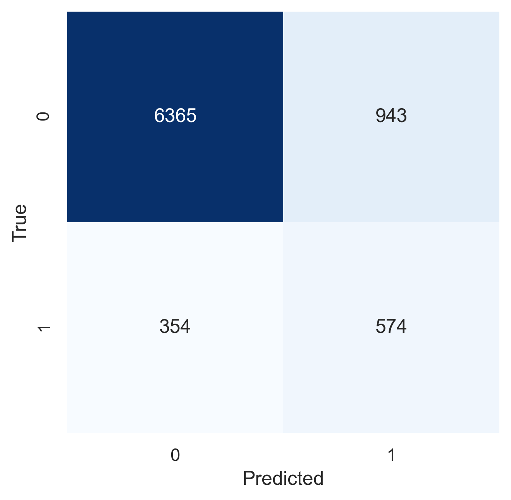
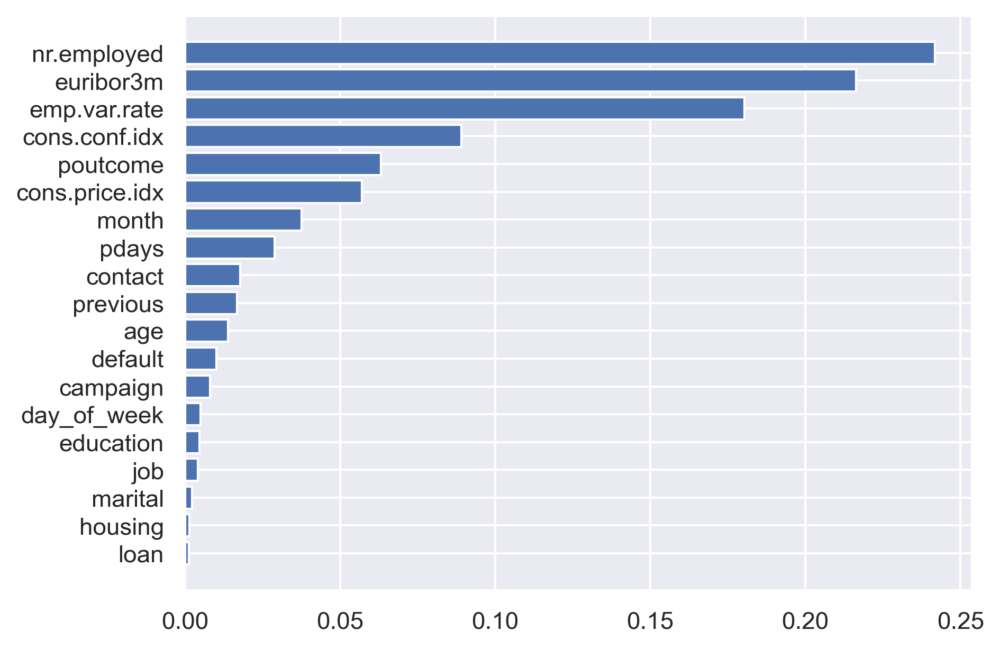
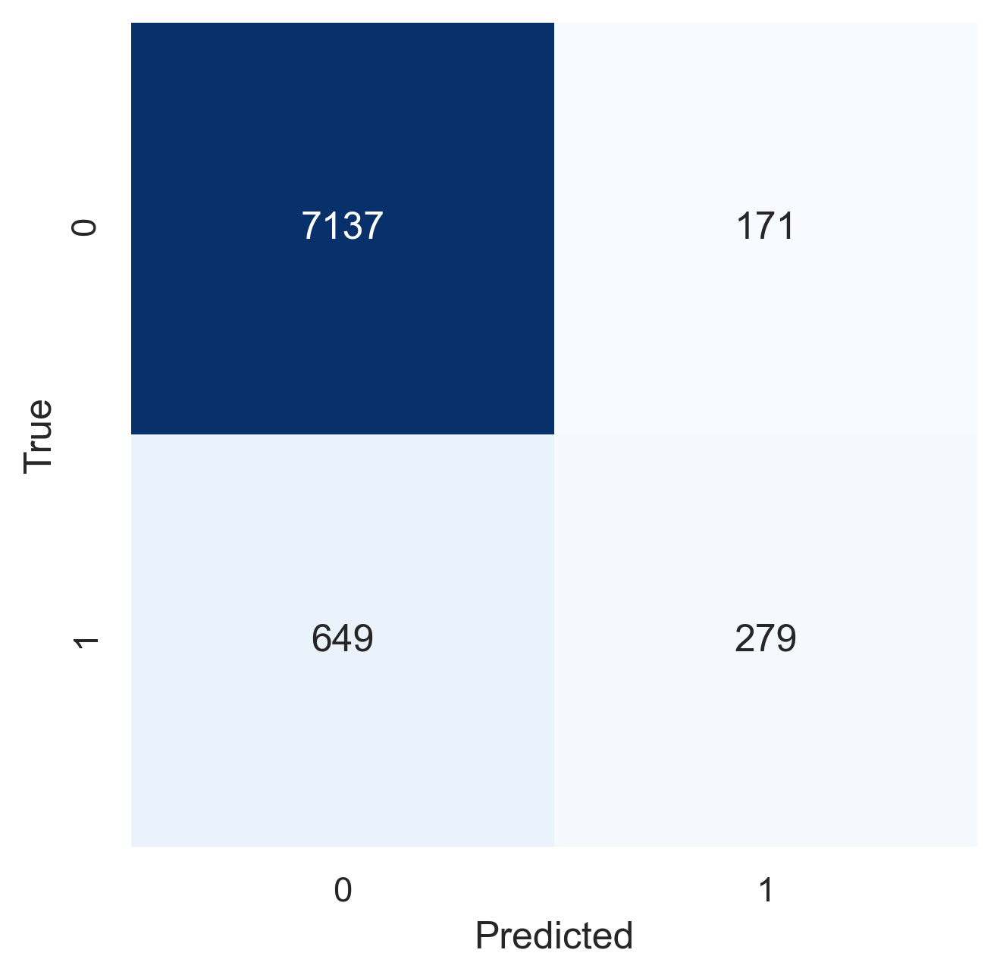
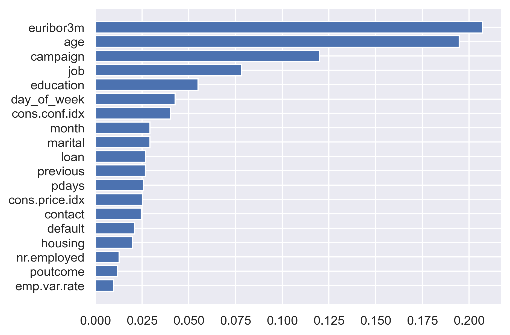
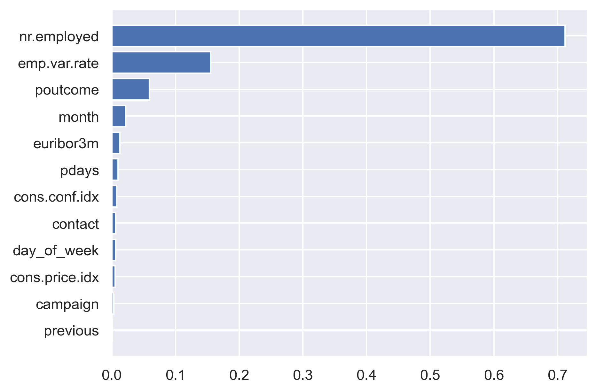

# Decision Tree and Its Ensembles
```{=latex}
\chapterauthor{Strahinja Trenkic}
```

## Decison Tree
A decision tree is a flowchart-like structure in which each internal node represents a "test" on an attribute (e.g. whether a coin flip comes up heads or tails), each branch represents the outcome of the test, and each leaf node represents a class label (decision taken after computing all attributes). The paths from root to leaf represent classification rules.

In Machine Learning this type of structure can be used to advise in classification and regression problems. Since our project's topic was a classification problem in its nature, we will focus on the decision Tree as a classifier in the remainder of the text.

Here is an outline of hyperparameters most commonly tuned for performance:

- **max_depth:** The maximum depth of the tree. If None, then nodes are expanded until all leaves are pure or until all leaves contain less than min_samples_split samples.
- **min_samples_split:** The minimum number of samples required to split an internal node.
- **criterion:** The function to measure the quality of a split. Supported criteria are “gini” for the Gini impurity and “entropy” for the information gain. Note: this parameter is tree-specific.
- **min_samples_leaf:** The minimum number of samples required to be at a leaf node.
- **class_weight:** Weights associated with classes. If not given, all classes are supposed to have weight one.
- **random_state:** Controls both the randomness of the bootstrapping of the samples used when building trees and the sampling of the features to consider when looking for the best split at each node.

It is important to note that Decision Trees can be combined to form Forests and can be used as primitive estimators in AdaBoost. This makes them redundant in terms of accuracy to these more advanced models that use trees as a base. It is still however necessary to understand the individual tree estimator in order to understand how these more advance structures work. The tree is also cheaper in terms of computing requirements and can be used as an initial estimator or for feature importance analysis. 

To keep the scope of this paper reasonable, we will focus on elaborating on these more advanced models (Forest and AdaBoost) while keeping in mind that in their very foundation there is a tree, silently doing it's job.

## Random Forest

The Random Forest represents a collection of decision trees. This is a way of averaging multiple deep decision trees, trained on different parts of the same training set, with the goal of reducing the variance. This comes at the expense of a small increase in the bias and some loss of interpretability, but generally greatly boosts the performance in the final model.

In order to prepare the data for the Forest we first run it through our standard transformer, explained in the pipeline section of this text.

```python
tree_transformer = FunctionTransformer(dftransform)
X_train, y_train, X_test, y_test, *other_sets = split_dataset(bank_mkt, tree_transformer)
```

We then procede onto hyperparameter tuning. Hyperparameter tuning of the random forest is basically hyperparameter tuning of the individual tree with one prominent differences. Namely:

- **n_estimators:** which basically represents the number of trees in the forest.

In the case of our project:

```python
RF = RandomForestClassifier(random_state=42,
                            class_weight="balanced",
                            criterion ="gini",
                            max_features="auto", 
                            min_samples_split= 2)

param_grid = {
    'max_depth':[6,8,10],
    'n_estimators':[1000,1500,1750,2000]
}
CV_RFmodel = GridSearchCV(estimator=RF,
                          param_grid=param_grid,
                          scoring="average_precision",
                          n_jobs=-1,
                          cv=2)
CV_RFmodel.fit(X_train,y_train)
grid_results = CV_RFmodel.cv_results_
grid_best_params = CV_RFmodel.best_params_
grid_best_score = CV_RFmodel.best_score_
grid_best_estimator = CV_RFmodel.best_estimator_
print(f"best mean test score: {grid_best_score}, for {grid_best_estimator}")
```

It is worth noting that we also tried combinations of other hyperparameters, but for easier readability of the text decided to go here with the two hyperparameters that provide with highest model oscillations. The hyperparameters that were selected for the RandomForestClassifier in the definition of variable RF are the ones that showed in previous tunings to provide constant, superior results. The outputs given were 

```
best mean test score: 0.454011896674566,
for RandomForestClassifier(class_weight='balanced',
max_depth=6, n_estimators= 1750,random_state=42)
```

```python
RF_validation = RandomForestClassifier(random_state=42,
                                       class_weight="balanced",
                                       max_depth=6,
                                       n_estimators=1750,
                                       max_leaf_nodes=1000)
benchmark(bank_mkt, tree_transformer, RF_validation)
```

|      | Train    | Validate | Test     |
| ---- | -------- | -------- | -------- |
| TNR  | 0.866655 | 0.864865 | 0.870963 |
| TPR  | 0.627821 | 0.629380 | 0.618534 |
| bACC | 0.747238 | 0.747122 | 0.744749 |
| ROC  | 0.813153 | 0.801666 | 0.801848 |
| REC  | 0.627821 | 0.629380 | 0.618534 |
| PRE  | 0.374147 | 0.371519 | 0.378378 |
| AP   | 0.503536 | 0.449784 | 0.474725 |
: Performance metrics of Random Forest

{width=45%}

As can be seen from the table, `RandomForestClassifier` gives strong values in AUC ROC and proves in our dataset to be one of the best performing models. 

One interesting use of the `RandomForestClassifier` is that it also returns feature importance metrics for individual features within the dataset. This can be a very useful method of the class since it allows a positive feedback loop between feature engineering, model testing and then returning to feature engineering for additional optimisations and manipulations on the most useful features. On the other hand, features that show no importance in the classification can be dropped or merged. This can be plotted to give an informative picture about how features rank by importance:

```python
columns = bank_mkt.drop(["duration", "y"], axis=1).columns.tolist()
rnd_clf = RandomForestClassifier(n_estimators=1750,max_depth=6, n_jobs=-1, random_state=42)
rnd_clf.fit(X_train, y_train)
for name, importance in zip(columns, rnd_clf.feature_importances_):
    print(name, "=", importance)
importances = rnd_clf.feature_importances_
indices = np.argsort(importances)
plt.barh(range(len(indices)), importances[indices], color='b', align='center')
plt.yticks(range(len(indices)), [columns[i] for i in indices])
plt.size=(15,10)
plt.show()
```



All in all the Random Forest lived up to its expectation. By adding just a small amount of bias it greatly improves the performance of Decision Trees. They are very robust and require little to none work in terms of encoding and feature manipulation. 

## AdaBoost

An AdaBoost classifier is a meta-estimator that begins by fitting a classifier on the original dataset and then fits additional copies of the classifier on the same dataset but where the weights of incorrectly classified instances are adjusted such that subsequent classifiers focus more on difficult cases.

The AdaBoost uses simple, primitive individual classifiers but in comparison with the Random Forest it gives them different, ever changing weights to their final decision. The individual primitive estimator is one of the hyperparameters

- **base_estimator:** The base estimator from which the boosted ensemble is built. Support for sample weighting is required, as well as proper `classes_` and `n_classes_` attributes. If `None`, then the base estimator is `DecisionTreeClassifier(max_depth=1)`.

The process of tuning this parameter can at starts feel counterintuitive. Why wouldn't a tree of max_depth=2 return better overall results than this stump with only depth level of one. In this question lies the beauty and genius of this model. Because many individually primitive estimators with weighted, individually adjusted  decisions will overall provide with a more effective and efficient model.

The other important hyperparameters to tune in the AdaBoost Classifier are

- **learning_rate:** Learning rate shrinks the contribution of each classifier by `learning_rate`. There is a trade-off between `learning_rate` and `n_estimators`.
- **n_estimators:** The maximum number of estimators at which boosting is terminated. In case of perfect fit, the learning procedure is stopped early.

```python
AB = AdaBoostClassifier(n_estimators=100,random_state=42,learning_rate=1.0)
param_grid = {
    'learning_rate':[0.8],
    'n_estimators':[800],
    'base_estimator':[DecisionTreeClassifier(max_depth=1),
                      DecisionTreeClassifier(max_depth=4)]
}
CV_RFmodel = GridSearchCV(estimator=AB,
                          param_grid=param_grid,
                          scoring="average_precision",
                          n_jobs=-1,
                          cv=5)
CV_RFmodel.fit(X_train,y_train)
grid_results = CV_RFmodel.cv_results_
grid_best_params = CV_RFmodel.best_params_
grid_best_score = CV_RFmodel.best_score_
grid_best_estimator = CV_RFmodel.best_estimator_
print(f"best mean test score: {grid_best_score}, for {grid_best_estimator}")
```

Which gave us the optimal model set up:

```
best mean test score: 0.448988423603947,
for AdaBoostClassifier(base_estimator=DecisionTreeClassifier(max_depth=1),
learning_rate=0.8, n_estimators=800, random_state=42)
```

We proceeded to find the full performance matrix:

```python
AB_validation = AdaBoostClassifier(n_estimators=800,
                                   learning_rate=0.8,random_state=42,
                                   base_estimator = DecisionTreeClassifier(max_depth=2,min_samples_split=2))

benchmark(bank_mkt, tree_transformer, AB_validation)
```

|      | Train    | Validate | Test     |
| ---- | -------- | -------- | -------- |
| TNR  | 0.985982 | 0.972650 | 0.979312 |
| TPR  | 0.393488 | 0.262162 | 0.272630 |
| bACC | 0.689715 | 0.617406 | 0.625971 |
| ROC  | 0.878366 | 0.743267 | 0.757640 |
| REC  | 0.393448 | 0.262162 | 0.272630 |
| PRE  | 0.780308 | 0.58023  | 0.628933 |
| F1   | 0.523125 | 0.354662 | 0.380386 |
| AP   | 0.632423 | 0.374018 | 0.423666 |
: Performance metrics of AdaBoost

In a similar fashion we derive the feature importance as well:

```python
for name, importance in zip(columns, AB_validation.feature_importances_):
    print(name, "=", importance)
importances = AB_validation.feature_importances_
indices = np.argsort(importances)
plt.barh(range(len(indices)), importances[indices])
plt.yticks(range(len(indices)), [columns[i] for i in indices])
plt.show()
```
{width=45%}



As we can see the AdaBoost gave strong results in the area underneath the ROC curve but was still behind the Random Forest for our dataset. The main advantages of Random forests over AdaBoost are that it is less affected by noise and it generalizes better in reducing variance because the generalization error reaches a limit with an increasing number of trees being grown according to the Central Limit Theorem.

Feature importance for both AdaBoost and the Random Forest was strikingly similar. In the paper Random Forests, @breiman_random_2001 states the following conjecture: "AdaBoost is a Random Forest". This is an interesting claim, yet to be proven or disproven but AdaBoost with the base estimator of a tree stump can in certain datasets behave very much like a Random Forest of sorts. Proven or disproven it just confirms once more what we discussed in class, that Machine Learning is a trial and error process and data speaks its own language. There are no universal truths and ad-hoc solutions in this exciting field.

## XGBoost
Gradient Boosting is another boosting algorithm. Similar to AdaBoost, Gradient Boosting sequentially add predictors to an ensemble and corrects its predecessor. However, instead of tuning the weights at each iteration, Gradient Boosting fits the residual errors made by the predecessor. Even though Gradient Boosting is part of the `scikit-learn` collections, better performance can be achieved by using other libraries, such as `XGBoost`.

In our practice, even though `XGBoost` provides dozens of hyperparameters, just by tuning `max_depth` manually and dropping demographic features gives us satisfactory results.

```python
drop_features = ["age",
                 "job",
                 "marital",
                 "education",
                 "housing",
                 "loan",
                 "default"]
drop_prep = FunctionTransformer(dftransform, 
                                kw_args={"drop": drop_features,
                                         "to_float":True}
xgb_clf = XGBClassifier(max_depth=3, scale_pos_weight=8)
benchmark(bank_mkt, drop_prep, xgb_clf)
```

|      | Train    | Validate | Test     |
| ---- | -------- | -------- | -------- |
| TNR  | 0.849335 | 0.845535 | 0.856596 |
| TPR  | 0.666218 | 0.659030 | 0.644397 |
| bACC | 0.757776 | 0.752283 | 0.750496 |
| ROC  | 0.826341 | 0.807138 | 0.812991 |
| REC  | 0.666218 | 0.659030 | 0.644397 |
| PRE  | 0.359571 | 0.351293 | 0.363305 |
| AP   | 0.518830 | 0.479562 | 0.483435 |
: Performance metrics of XGBoost

{width=45%}

The feature importance plot shows that economic indicators and previous compaign outcome are the key predicators.


